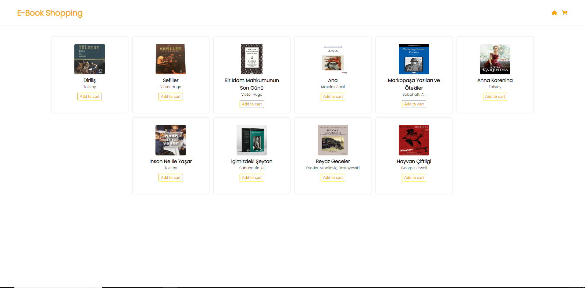
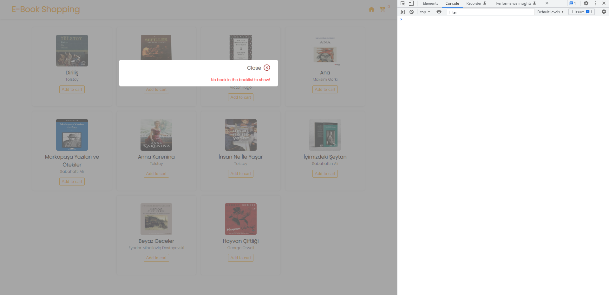

<h2>Shopping Cart was created by using Vanilla JS</h2>

This project was done the following technologies:

<ul>
<li>HTML5</li>
<li>Sass</li>
<li>Vanilla JS
    <ol>
    <li>.map() method</li>
    <li>.filter() method</li>
    <li>.reduce() method</li>
    </ol>
</li>
<li>Also you can access live demo of <a href="https://fahriakbaba-shopping-cart.netlify.app/" target="_blank">this project</a></li>
</ul>

